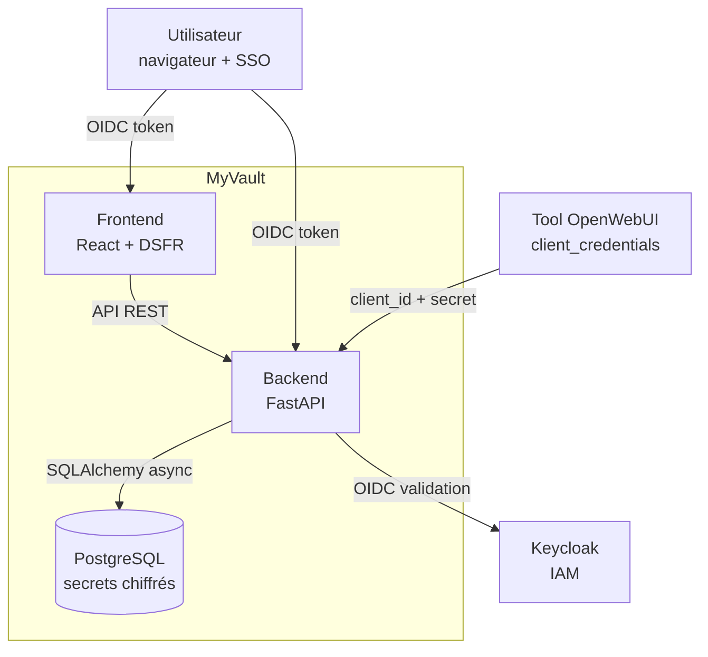
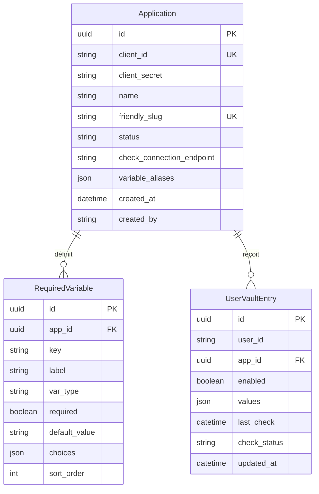

# Architecture technique — MyVault

## Vue d'ensemble



## Stack technique

| Couche | Technologie | Justification |
|--------|-------------|---------------|
| Backend | FastAPI (Python 3.12) | Performance async, OpenAPI auto-générée, écosystème Python ML/AI |
| Frontend | React 18 + TypeScript | Composants DSFR disponibles, SPA réactive |
| UI Kit | @codegouvfr/react-dsfr | Design System de l'État Français, conformité RGAA |
| Base de données | PostgreSQL 16 | Robuste, JSON natif, chiffrement au repos possible |
| ORM | SQLAlchemy 2.0 (async) | Migrations Alembic, modèles déclaratifs |
| Chiffrement | cryptography (AES-256-GCM) | Standard, performant, authentifié |
| Auth | python-jose (JWT/OIDC) | Validation tokens Keycloak |
| HTTP client | httpx | Async, HTTP/2, timeouts |

## Modèle de données



## Sécurité

### Chiffrement des secrets

```
Master Key (K8s Secret)
        │
        ▼ HKDF-SHA256
User Key = HKDF(master_key, info="myvault-user-{user_id}")
        │
        ▼ AES-256-GCM
Ciphertext = Nonce (12 bytes) + AES-GCM(user_key, plaintext)
        │
        ▼ Base64
Stored Value = base64(nonce + ciphertext)
```

- Chaque utilisateur a une clé unique dérivée de la clé maître
- Chaque chiffrement utilise un nonce aléatoire unique (12 octets)
- AES-GCM fournit confidentialité ET intégrité (AEAD)
- La clé maître est stockée dans un Secret Kubernetes, jamais dans le code

### Authentification

| Acteur | Méthode | Token/Credentials |
|--------|---------|-------------------|
| Utilisateur | OIDC (Keycloak) | JWT Bearer token |
| Admin | OIDC + rôle `myvault-admin` | JWT avec rôle |
| Tool/Machine | client_credentials | X-Client-Id + X-Client-Secret |

### Matrice de permissions

| Ressource | Utilisateur | Admin | Tool |
|-----------|-------------|-------|------|
| Ses propres secrets | CRUD | - | Lecture (si enabled) |
| Secrets d'autres users | - | - | Lecture (si enabled) |
| Valeurs des secrets | Oui | JAMAIS | Oui (déchiffré) |
| Applications (CRUD) | - | CRUD | Auto-enroll |
| Liste utilisateurs | - | Lecture (sans valeurs) | - |

### Audit

Chaque accès à un secret est journalisé :
- Action : READ, WRITE, TOGGLE, TOOL_READ
- Identité : qui (user_id), pour qui (accessed_by)
- Contexte : quelle app (app_slug)
- **Jamais** la valeur du secret

## Décisions d'architecture (ADR)

### ADR-001 : Chiffrement applicatif plutôt qu'OpenBao/Infisical

**Décision** : Chiffrement applicatif (PostgreSQL + AES-256-GCM) plutôt qu'OpenBao ou Infisical.

**Résumé** : L'unseal ceremony d'OpenBao est disproportionnée pour un coffre-fort utilisateur, Infisical ajoute une dépendance externe. Le chiffrement applicatif avec AES-256-GCM + HKDF offre une sécurité équivalente pour ce modèle de menace, en ~50 lignes de code auditables, sans dépendance supplémentaire. Réversible si le besoin évolue (rotation automatique, PKI, etc.).

> **Document complet** : [ADR-001 — Choix du moteur de secrets](adr/ADR-001-choix-moteur-secrets.md)

### ADR-002 : React + DSFR plutôt que Vue

**Décision** : React avec @codegouvfr/react-dsfr.

**Raison** : le package react-dsfr est le plus maintenu et complet pour le DSFR.

### ADR-003 : Format Keycloak pour l'interopérabilité

**Décision** : L'import/export utilise le format `client` Keycloak.

**Raison** : compatibilité directe avec le Keycloak existant de l'écosystème.

## Déploiement

### Docker (local)

```
docker-compose.yml
├── postgres (PostgreSQL 16, volume persistant)
├── backend  (FastAPI, port 8000)
└── frontend (Nginx + React, port 3000)
```

### Kubernetes (production)

```
Ingress (TLS) → myvault.example.com
├── /api/*  → Service backend (3 replicas)
└── /*      → Service frontend (2 replicas)

PostgreSQL → PVC 5Gi, 1 replica
Secrets K8s → master key, DB password, OIDC credentials
```
