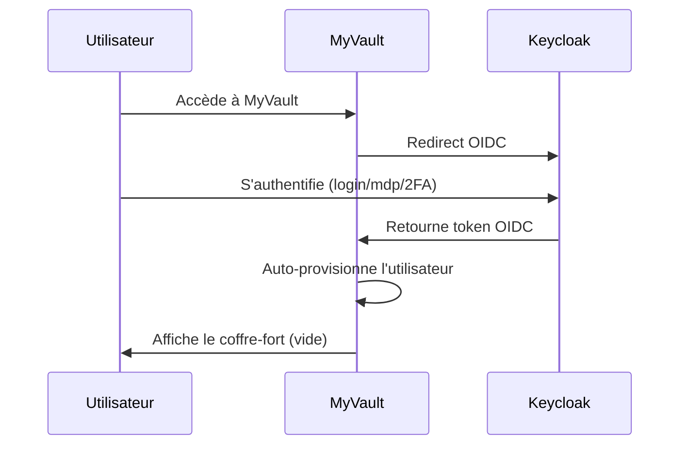
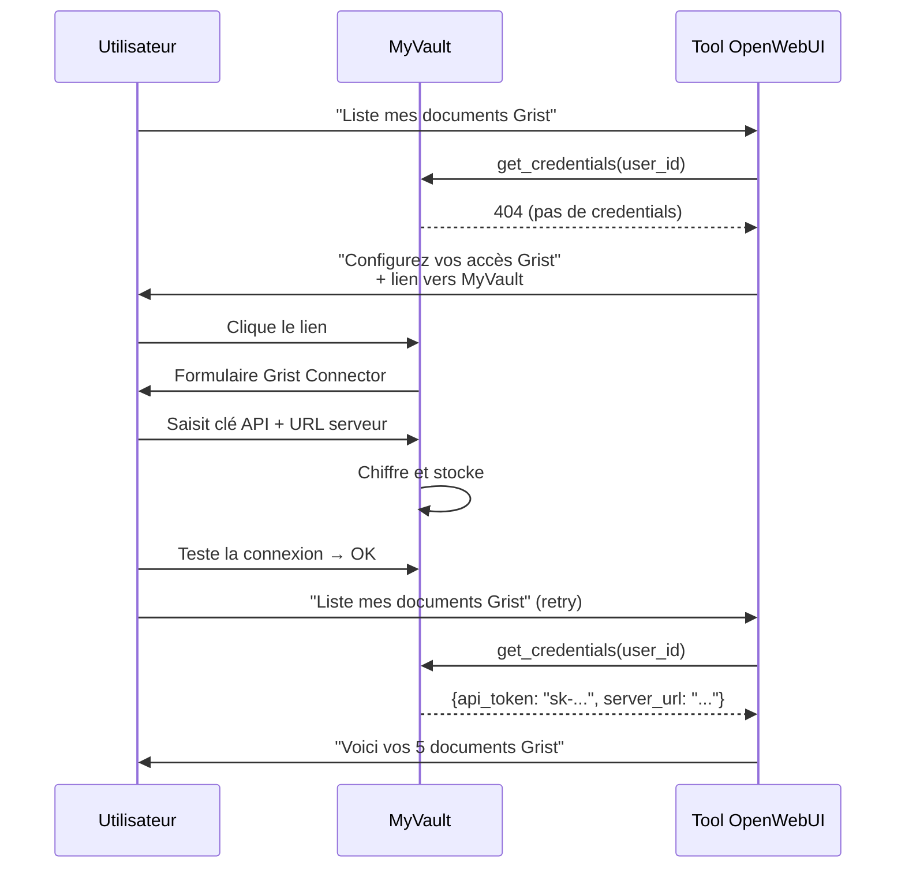

# Spécification fonctionnelle — MyVault

## Vision produit

### Problème

Les agents de l'État utilisant MirAI (OpenWebUI) et les outils de la Fabrique Numérique doivent fournir des identifiants (clés API, tokens, mots de passe) à de nombreuses applications. Ces identifiants sont souvent :
- Stockés de manière non sécurisée (fichiers texte, variables d'environnement partagées)
- Disséminés dans plusieurs outils sans centralisation
- Difficiles à mettre à jour lors d'une rotation

### Solution

MyVault est un **coffre-fort personnel centralisé** où chaque agent stocke ses identifiants une seule fois. Les outils (tools OpenWebUI, applications internes) récupèrent ces identifiants de manière sécurisée et transparente.

### Personas

| Persona | Description | Besoins |
|---------|-------------|---------|
| Agent utilisateur | Agent de l'État utilisant MirAI au quotidien | Stocker ses identifiants, les gérer facilement, comprendre quand un outil les demande |
| Admin SDID | Administrateur du système d'information | Gérer les applications, surveiller les connexions, importer/exporter |
| Développeur tool | Développeur créant des tools OpenWebUI | Intégrer MyVault dans ses tools, auto-enrôlement, SDK |

## Parcours utilisateur

### Première connexion



### Configuration d'un tool



## Règles métier

1. **Isolation des secrets** : un utilisateur ne voit que ses propres secrets
2. **Admin aveugle** : un administrateur ne voit JAMAIS les valeurs des secrets utilisateur
3. **Désactivation** : désactiver une app empêche les tools de lire les credentials (mais les valeurs restent stockées)
4. **Auto-enrôlement** : un tool peut créer automatiquement une application dans MyVault si elle n'existe pas, à condition de fournir un client_id et client_secret valides
5. **Types de variables** : chaque variable a un type qui détermine son rendu IHM et si elle est chiffrée

## Catalogue des types de variables

| Type | Code | Rendu IHM | Stockage |
|------|------|-----------|----------|
| Texte court | `text` | Input texte | Clair |
| Texte long | `textarea` | Textarea | Clair |
| Numérique | `number` | Input number | Clair |
| Booléen | `boolean` | Toggle switch | Clair |
| URL | `url` | Input URL (validé) | Clair |
| Email | `email` | Input email (validé) | Clair |
| Sélection | `select` | Dropdown | Clair |
| Multi-sélection | `multi_select` | Checkboxes | Clair |
| Secret | `secret` | Input masqué + œil + copier | **Chiffré** |
| Clé API | `api_key` | Input masqué + œil + copier | **Chiffré** |
| Login | `login` | Input texte | **Chiffré** |
| Mot de passe | `password` | Input masqué + œil + copier | **Chiffré** |
| Token OAuth | `oauth_token` | Input masqué + œil + copier | **Chiffré** |
| Certificat | `certificate` | Upload / textarea PEM | **Chiffré** |
| JSON | `json` | Éditeur code (JSON) | **Chiffré** (opt.) |

## Format d'échange Keycloak

L'import/export utilise un format JSON compatible avec la structure `client` de Keycloak. Les attributs spécifiques à MyVault sont stockés dans `attributes` :

```json
{
  "clients": [
    {
      "clientId": "myvault-grist-tool",
      "name": "Grist Connector",
      "secret": "...",
      "enabled": true,
      "protocol": "openid-connect",
      "attributes": {
        "myvault.variables": "[{\"key\": \"api_token\", ...}]",
        "myvault.check_endpoint": "/api/v1/tools/grist/check"
      }
    }
  ]
}
```
